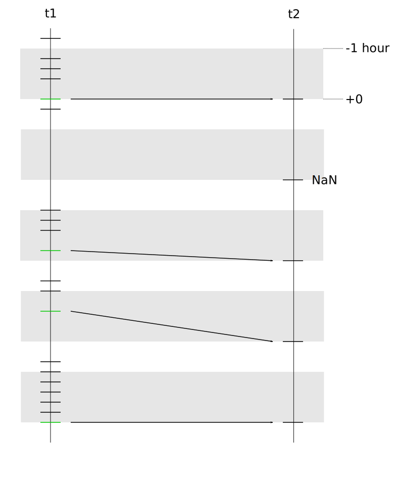

# dtts

`dtts` provides time-series functionality based on `nanotime` and `data.table`.

## Motivation

Combining package [`nanotime`](https://CRAN.R-project.org/package=nanotime) for
operating with nanosecond time-resolution with package
[`data.table`](https://CRAN.R-project.org/package=data.table) leverages
the conciseness, high performance, and memory efficiency of the
latter to provide high-resolution, high-performance time series operations.

Our time-series representation is simply a `data.table` with a first column
of type `nanotime` and a key on it. This means all the standard `data.table`
functions can be used, and this package consolidates this functionality.

Specifically, `dtts` proposes alignment functions that are particularly
versatile, and allow to work across time-zones.

## Usage

### Creating a `data.table`-based time-series with a `nanotime` index

Three operations are necessary to create a `data.table`-based
time-series for use with the functions defined in this package:
1. Create the time index, i.e. a vector of `nanotime`
2. Create a `data.table` with the first column being the time index 
   and specifying it as a key

For instance, this code creates a time-series of 10 rows spaced every
hour with a data column `V1` containing random data:

~~~ R
library(data.table)
library(nanotime)
t1 <- seq(as.nanotime(Sys.time()), by=as.nanoduration("01:00:00"), length.out=10)
dt1 <- data.table(index=t1, V1=runif(10), key="index")
~~~

produces:

~~~
                               index        V1
 1: 2021-11-21T06:23:12.404650+00:00 0.7206800
 2: 2021-11-21T07:23:12.404650+00:00 0.9677868
 3: 2021-11-21T08:23:12.404650+00:00 0.6211587
 4: 2021-11-21T09:23:12.404650+00:00 0.7669201
 5: 2021-11-21T10:23:12.404650+00:00 0.6426368
 6: 2021-11-21T11:23:12.404650+00:00 0.4026811
 7: 2021-11-21T12:23:12.404650+00:00 0.2512213
 8: 2021-11-21T13:23:12.404650+00:00 0.3476128
 9: 2021-11-21T14:23:12.404650+00:00 0.9663271
10: 2021-11-21T15:23:12.404650+00:00 0.4744729
~~~

(Note that we can also write this in a single `data.table` statement as

~~~ R
dt1 <- data.table(index = seq(as.nanotime(Sys.time()), by=as.nanoduration("01:00:00"), length.out=10),
                  V1 = runif(10),
                  key = "index")
~~~

### Alignment functions

Alignment is the process of matching the time of the observations of
one time series to another. All alignment functions in this package
work in a similar way. For each point in the vector `y` onto which `x`
is aligned, a pair or arguments named `start` and `end` define an
interval around this point. As an example let us take `start` equal to
-1 hour and `end` equal to 0 hour. This means that a `y` of 2021-11-20
11:00:00 defines an interval from 2021-11-20 10:00:00 to 2021-11-20
11:00:00. The alignment process will then use that interval to pick
points in order to compute one or more statistics on that interval for
the corresponding point in `y`.

In addition to the arguments `start` and `end`, two other arguments,
booleans named `sopen` and `eopen`, define if the start and end,
respectively, of the interval are open or not.

Finally, note that when the interval is specified with a `nanoperiod`
type, the argument `tz` is necessary in order to give meaning to the
interval. With `nanoperiod`, alignments are time-zone aware and
correct across daylight saving time.

This figure shows an alignment using the "closest"
point as data:




This figure shows an alignment using a statistic
(here simply counting the number of elements in the intervals):


#### `align.idx`

This function takes two vectors of type `nanotime`. It aligns the
first one onto the second one and returns the indices of the first
vector that align with the second vector. There is no choice of
aggregation function here as this function works uniquely on
`nanotime` vectors. The algorithm selects the point in `x` that falls
in the interval that is closest to the point of alignment in `y`. The
index of the point that falls in that interval is returned at the
position of the vector `y`. If no point exists in that interval `NaN`
is returned.


~~~ R
library(dtts)

t1 <- seq(as.nanotime("1970-01-01T00:00:00+00:00"), by=as.nanoduration("00:00:01"), length.out=100)
t2 <- seq(as.nanotime("1970-01-01T00:00:10+00:00"), by=as.nanoduration("00:00:10"), length.out=10)

align.idx(t1, t2, start=as.nanoduration("-00:00:10"))
~~~

Which produces:

~~~
 [1]  10  20  30  40  50  60  70  80  90 100
~~~

#### `align`

This function takes a `data.table` and aligns it onto `y`, a vector of
`nanotime`. Like `align.idx`, it uses the arguments `start`, `end`,
`sopen` and `eopen` to define the intervals around the points in `y`. 

Instead of the result being an index, it is a new `data.table`
time-series with the first `nanotime` column being the vector `y`, and
the rows of this time-series are taken from the `data.table` `x`. If
no function is specified (i.e. `func` is `NULL`), the function returns
the row of the point in `x` that is in the interval and that is
closest to the point in `y` on which the alignment is made. If `func`
is defined, it receives for each point in `y` all the rows in `x` that
are in the defined interval. So `func` must be a statistic that
returns one row, but it may return one or more columns. Common examples
are means (e.g. using `colMeans`), counts, etc.


In the following example a time-series `dt1` is created with a data
column `V1` which has the integer index as value and it is aligned
onto a `nanotime` vector `t2`

~~~ R
library(dtts)

t1 <- seq(as.nanotime("1970-01-01T00:00:00+00:00"), by=as.nanoduration("00:00:01"), length.out=100)
dt1 <- data.table(index=t1, V1=0:99)
setkey(dt1, index)

t2 <- seq(as.nanotime("1970-01-01T00:00:10+00:00"), by=as.nanoduration("00:00:10"), length.out=10)

align(dt1, t2, start=as.nanoduration("-00:00:10"), func=colMeans)
~~~

Which produces:

~~~
                        index   V1
 1: 1970-01-01T00:00:10+00:00  4.5
 2: 1970-01-01T00:00:20+00:00 14.5
 3: 1970-01-01T00:00:30+00:00 24.5
 4: 1970-01-01T00:00:40+00:00 34.5
 5: 1970-01-01T00:00:50+00:00 44.5
 6: 1970-01-01T00:01:00+00:00 54.5
 7: 1970-01-01T00:01:10+00:00 64.5
 8: 1970-01-01T00:01:20+00:00 74.5
 9: 1970-01-01T00:01:30+00:00 84.5
10: 1970-01-01T00:01:40+00:00 94.5
~~~

#### `grid.align`

This function adds one more dimension to the function `align`. Instead
of taking a vector `y`, it constructs a grid that has as interval the
value supplied in the argument `by`. The interval is controllable
(with arguments `ival_start`, `ival_end`, `ival_sopen`, `ival_eopen`)
but it is likely that in most cases the default will be used which is
the grid interval. As in the case of `align`, the caller can specify
`func`. Finally, note that `by` can be either a `nanoduration` or a
`nanoperiod`. In the latter case, as for the other functions, the
argument `tz` must be supplied so that the `nanoperiod` interval can
be anchored to a specific timezone.

The following example is the same as for the `align` function, but
shows that the vector `t2` does not need to be supplied as it is
instead constructed by `grid.align`:

~~~ R
library(dtts)

t1 <- seq(as.nanotime("1970-01-01T00:00:00+00:00"), by=as.nanoduration("00:00:01"), length.out=100)
dt1 <- data.table(index=t1, V1=0:99)
setkey(dt1, index)

grid.align(dt1, as.nanoduration("00:00:10"), func=colMeans)
~~~

Which produces:

~~~
                        index   V1
 1: 1970-01-01T00:00:10+00:00  4.5
 2: 1970-01-01T00:00:20+00:00 14.5
 3: 1970-01-01T00:00:30+00:00 24.5
 4: 1970-01-01T00:00:40+00:00 34.5
 5: 1970-01-01T00:00:50+00:00 44.5
 6: 1970-01-01T00:01:00+00:00 54.5
 7: 1970-01-01T00:01:10+00:00 64.5
 8: 1970-01-01T00:01:20+00:00 74.5
 9: 1970-01-01T00:01:30+00:00 84.5
10: 1970-01-01T00:01:40+00:00 94.5
~~~

#### Frequency

Using `grid.align` and `nrow` it is possible to get the frequency of a
time-series, i.e. to count the number of elements in each interval of
a grid.

Taking the same example as above, we see that the result is the count
of elements of `dt1` that are in each interval:

~~~ R
library(dtts)

t1 <- seq(as.nanotime("1970-01-01T00:00:00+00:00"), by=as.nanoduration("00:00:01"), length.out=100)
dt1 <- data.table(index=t1, V1=0:99)
setkey(dt1, index)

grid.align(dt1, as.nanoduration("00:00:10"), func=nrow)
~~~

Which produces:

~~~
                        index V1
 1: 1970-01-01T00:00:10+00:00 10
 2: 1970-01-01T00:00:20+00:00 10
 3: 1970-01-01T00:00:30+00:00 10
 4: 1970-01-01T00:00:40+00:00 10
 5: 1970-01-01T00:00:50+00:00 10
 6: 1970-01-01T00:01:00+00:00 10
 7: 1970-01-01T00:01:10+00:00 10
 8: 1970-01-01T00:01:20+00:00 10
 9: 1970-01-01T00:01:30+00:00 10
10: 1970-01-01T00:01:40+00:00 10
~~~


### Time-series subsetting

Using `nanoival`, it is possible to do complex subsetting of a time-series:

~~~ R
one_second <- 1e9
index <- seq(nanotime("2022-12-12 12:12:10+00:00"), length.out=10, by=one_second)
dts <- data.table(index=index, data=1:length(index), key="index")
ival <- c(as.nanoival("-2022-12-12 12:12:10+00:00 -> 2022-12-12 12:12:14+00:00-"),
          as.nanoival("+2022-12-12 12:12:18+00:00 -> 2022-12-12 12:12:20+00:00+"))
dts[index %in% ival]

~~~

## Status

`dtts` currently proposes only a set of alignment functions, but it is
likely that other time-series functions will be impletemented so that
`nanotime`-based time-series have reasonably complete time-series
functionality.

See the [issue tickets](https://github.com/eddelbuettel/dtts/issues)
for an up to date list of potentially desirable, possibly planned, or
at least discussed items.

## Installation

```r
remotes::install_github("eddelbuettel/dtts.utils")
```

## Author

Dirk Eddelbuettel, Leonardo Silvestri

## License

GPL (>= 2)
